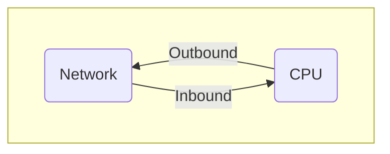

# Asynchronous Pipeline

This design document describes an asynchronous Pub/Sub Pipeline that relies on the Hierarchical Finite State Machine concept described within the [az_hfsm.md](az_hfsm.md) specification.

The proposed construct is a variant of the existing Azure SDK for Embedded C SDK request/response [synchronous pipeline](https://github.com/Azure/azure-sdk-for-c/blob/9f5a6334863ebbf214c6e2fbd5d6e3fce52fe0de/sdk/inc/azure/core/internal/az_http_internal.h#L21).

## Requirements

1. Support for both synchronous and asynchronous Pub/Sub network interfaces.
2. Support for both synchronous and asynchronous application requests (public API interface).
3. No memory allocation required when adapting between different messages: the application provides the memory.
4. Provides run-to-completion semantics leveraging the SDK’s platform layer.
5. Provides timing operations leveraging the SDK’s platform layer.

## Design Details

The Async Pipeline is used to compose multiple HFSMs without compromising encapsulation.

Advanced users of the Azure SDK for Embedded C can define their own pipelines by composing several pipeline policies such as the Retry Policy, specific service policies (DPS, ADU, etc) and the MQTT Policy.

Example IoT Client pipeline architecture:


Async Policy object model:


### Bi-directional Communication

Because the MQTT / IoT protocols are PUB/SUB (instead of Request/Response), the design of the pipeline must allow directional communication:



Direction is defined relative to the device vs network:

- Outbound communication is defined as being sent from the device towards the network.
- Inbound communication is defined as being received by the device from the network.

### Events

The Pipeline accepts `az_event` typed events. External events are passed to the pipeline:

- Posted towards the outbound end if they originate from the application side (either public API calls or timing events).
- Posted towards the inbound end if they originate from the network side.

Events move either outbound or inbound, through each of the policy components of the pipeline. With each step, the current policy may choose to change state, change the type of event, create new events or simply forward the event.

#### Event allocation and lifetime

Based on life-time and ownership, there are two types of events:

##### Long-lived events

Events that originate outside of the pipeline, usually generated by declarative APIs performing long-running operations are considered long-lived events.
These events must outlive the pipeline outbound or inbound execution call-stack and are allocated by the application. Their lifetime must be guaranteed by the application and depends on the execution time and semantics of the requested operation.
An example of such an event is `AZ_MQTT5_EVENT_RPC_CLIENT_INVOKE_REQ` which performs a remote procedure client request. This operation could take anywhere between a few seconds to minutes or even hours (if the network or broker is not currently available). Application can free the event_data only upon receiving the `AZ_MQTT5_EVENT_RPC_CLIENT_RSP` event which requires multiple state changes and MQTT messages sent over the wire.

##### Short-lived events

Events that originate within the pipeline, usually generated by policies to perform data adaptation, are considered short-lived events.
These events are valid only during a single outbound or inbound event processing (on a single pipeline call-stack).
Short-lived events are allocated on the stack and have the same semantics and purpose as function arguments.
E.g. `AZ_MQTT5_EVENT_RPC_CLIENT_INVOKE_REQ` will be translated into multiple events such as `AZ_HFSM_MQTT_EVENT_CONNECT_REQ`, `AZ_HFSM_MQTT_EVENT_SUB_REQ`, `AZ_HFSM_MQTT_EVENT_PUB_REQ`, etc all of which are short-lived and may re-use buffers pre-allocated by the application and passed within the original register’s event data field.

Inbound lifetime requirements:

1. When data is received, it must be kept available until the callback exits.
1. The networking stack must be stalled until the callback exits.

Note that the networking stack's callbacks can be re-entrant. In such cases, the pipeline will need to make use of an `az_platform_mutex`. (See the [run-to-completion](#pipelines-enforce-run-to-completion) paragraph below).

#### No memory allocation and no buffer copies

Events must rely only on references to buffers pre-allocated by either the application or the network stack (e.g. from an RTOS memory pool). To reference larger memory locations, the `az_span` construct must be leveraged within the event data structure.
Event data structures must be maintained relatively small compared with the actual data. E.g., data such as `username_buffer`, `topic_buffer`, `payload_buffer`, etc is only passed as reference.

### Send vs Post

The Async Pipeline has similar semantics with hierarchical state machines present within the Windows GUI subsystem (SendMessage vs PostMessage):

- **Sending** a message must only be called from within the Pipeline context (from within a policy). The direction, either inbound or outbound, determines which policy, relative to the current policy will receive the message.
- **Posting** a message (either inbound or outbound) can only be called from outside the Pipeline context and is relative to the entire pipeline (i.e., the two policies at each end). Depending on the implementation, the message may be queued. Run-to-completion semantics must be guaranteed when running in a multi-threaded context (e.g. by using a mutex).

The expectation is that the Send API (either inbound or outbound) will not return until the next policy completes all operations (i.e., the execution is performed on the same call-stack). This allows policies to safely allocate short-lived events on the stack. An example could be any of the `AZ_MQTT5_EVENT_PUB_REQ` created on the stack by the RPC client. The MQTT client must ensure that once the `az_mqtt5_outbound_pub()` function exits, no further attempt to access the `AZ_MQTT5_EVENT_PUB_REQ` event data is made.

Posted events may be either implicitly (through chains of blocking mutexes) or explicitly queued. The application or network stack must be aware of this and ensure proper event lifetime. An example could be the `AZ_EVENT_MQTT5_CONNECTION_OPEN_REQ` event posted by `az_mqtt5_connection_open_begin()` API.

### Interval Timers

`az_platform.h` interval timers are created and associated with the pipeline using the `_az_event_pipeline_timer` API. The timers can then be configured using non-pipeline specific `az_platform` APIs (see dependencies below).
When the timer expires, an outbound `AZ_HFSM_EVENT_TIMEOUT` is posted. The event_data is a pointer to the `_az_event_pipeline_timer`. This enables pipelines to own more than one timer.
Unless the `AZ_HFSM_EVENT_TIMEOUT` event is consumed in the current policy, it must be passed through (using send) towards other outbound policies that need to receive the event.

### Pipelines enforce Run-To-Completion

Data flows either inbound or outbound through the pipeline at any time. For each posted event, the data is processed on the same stack. Not all components may get invoked if the event is filtered by one of the policies.
Each inbound or outbound operation is guarded by a mutex. There is a single mutex for the entire pipeline (i.e., an inbound and outbound operation cannot happen at the same time).

### Asynchronous Mode

In asynchronous mode, it is expected that all outbound and inbound events are processed immediately after being received by either the application or by the network stack. For example, in this mode of operation, it is expected that the network stack uses some form of call-backs to notify the client. The call-back will trigger a pipeline post of an inbound event.
Because of the Run-To-Completion guarantee, all operations within a pipeline, performed on resources owned by the pipeline, are thread-safe. At the same time, because a mutex is held, the operations must not block: all operations are either CPU-bound or non-blocking I/O.
In most cases, the CPU-bound pipeline code can run on any thread, task, or ISR.

### Synchronous Mode

In synchronous mode, either the outbound (e.g., API surface) or the inbound components (e.g., network stack) require a way to run their respective message loops. The Pipeline system can be configured at compile time to add synchronous message loop support through the az_hfsm_pipeline_sync_process_loop API.
The HFSM policies must be written to support the sync loop event, AZ_HFSM_PIPELINE_EVENT_PROCESS_LOOP, which is posted first as an outbound event (to queue all network writes) then as an inbound event (to process all buffered reads).

### Error handling

Because the asynchronous mode of operation, the pipeline supports two types of errors:

- Synchronous (I/O setup) path errors are immediately returned to the caller of either post or send event APIs.
- Asynchronous (I/O completion) path errors are returned when operations complete, through the standardized AZ_HFSM_EVENT_ERROR event.

In both cases, the error code is stored in a well-defined Azure SDK `az_result`. Asynchronous AZ_HFSM_EVENT_ERROR event contains more information such as the sender HFSM and event that triggered the error.

### Platform Dependencies

The Async Pipeline depends on the following two new `az_platform` PAL constructs:

```C
// Interval Timer Support
AZ_NODISCARD az_result az_platform_timer_create(
    az_platform_timer* timer,
    az_platform_timer_callback callback,
    void* sdk_data);

AZ_NODISCARD az_result az_platform_timer_start(az_platform_timer* timer, int32_t milliseconds);

AZ_NODISCARD az_result  az_platform_timer_destroy(az_platform_timer* timer);

// Mutex Support:
AZ_NODISCARD az_result az_platform_mutex_init(az_platform_mutex* mutex_handle);
AZ_NODISCARD az_result az_platform_mutex_acquire(az_platform_mutex* mutex_handle);
AZ_NODISCARD az_result az_platform_mutex_release(az_platform_mutex* mutex_handle);
AZ_NODISCARD az_result az_platform_mutex_destroy(az_platform_mutex* mutex_handle);
```

One of the concrete implementations can be found in `az_posix.c`.
