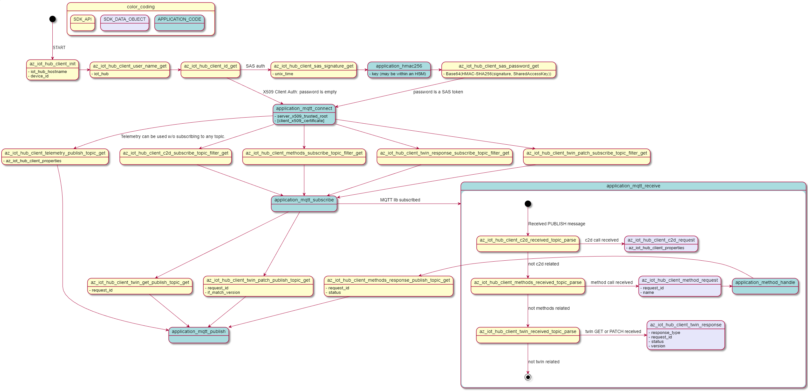
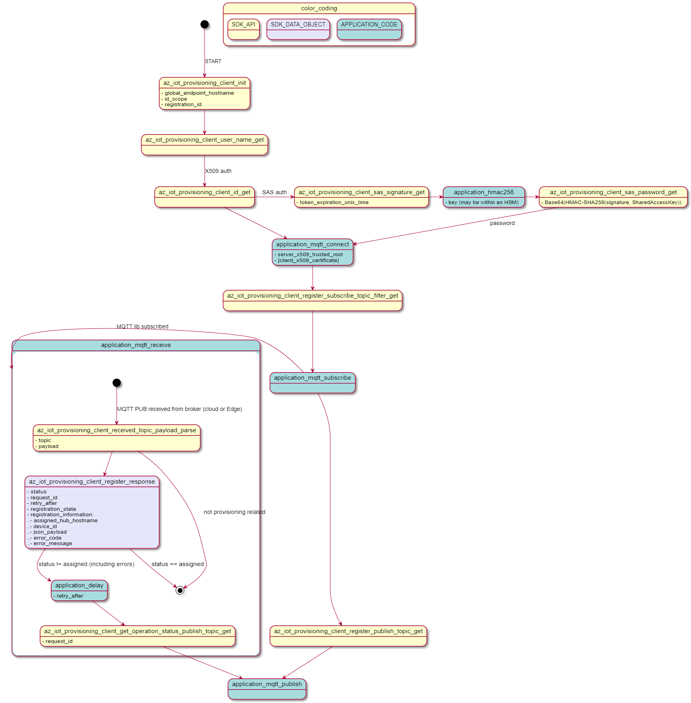
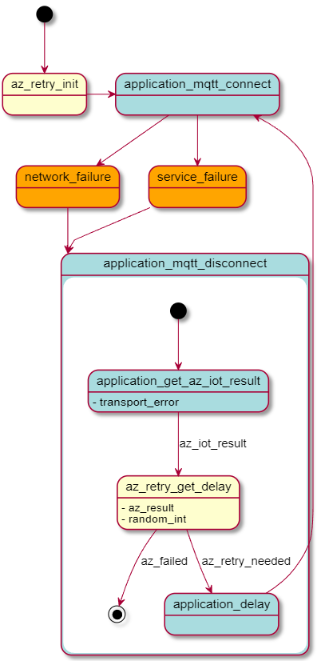

# Azure IoT Client MQTT State Machine

## High-level architecture

Device Provisioning and IoT Hub service protocols require additional state management on top of the MQTT protocol. The Azure IoT Hub and Provisioning clients for C provide a common programming model. The clients must be layered on top of an MQTT client selected by the application developer.

The following aspects are being handled by the SDK:

1. Generate MQTT CONNECT credentials.
1. Obtain SUBSCRIBE topic filters and PUBLISH topic strings required by various service features.
1. Parse service errors and output an uniform error object model.
1. Provide the correct sequence of events required to perform an operation.
1. Provide suggested timing information when retrying operations.

The following aspects need to be handled by the application or convenience layers:

1. Ensure secure TLS communication using either server or mutual X509 authentication.
1. Perform MQTT transport-level operations.
1. Delay execution for retry purposes.
1. (Optional) Provide real-time clock information and perform HMAC-SHA256 operations for SAS token generation.

For more information about Azure IoT services using MQTT see [this article](https://docs.microsoft.com/en-us/azure/iot-hub/iot-hub-mqtt-support).

## Components

### IoT Hub



### Device Provisioning Service



## Porting the IoT Clients

Requirements:

- C99 compiler.
- The target platform supports a stack of several kB.
- Types such as `uint8_t` must be defined.

The IoT clients provide adaptation from IoT concepts to the MQTT protocol. The IoT services support MQTT tunneling over WebSocket Secure which also enables WebProxy scenarios. Application developers are responsible with setting up the wss:// tunnel if they require this functionality.

- The SDK does not support unsubscribing from any of the previously subscribed topics. We assume that the device will only set-up topics that must be used.

## API

### Connecting

The application code is required to initialize the TLS and MQTT stacks.
Two authentication schemes are currently supported: _X509 Client Certificate Authentication_ and _Shared Access Signature_ authentication. 

When X509 client authentication is used, the MQTT password field should be an empty string.

If SAS tokens are used the following APIs provide a way to create as well as refresh the lifetime of the used token upon reconnect.

_Example:_
```C
if(az_failed(az_iot_hub_client_sas_signature_get(client, unix_time + 3600, signature, &signature)));
{
    // error.
}

// Base64Encode the HMAC256 of the az_span_ptr(signature) with the Shared Access Key.

if(az_failed(az_iot_hub_client_sas_password_get(client, base64_hmac_sha256_signature, NULL, password, &password)))
{
    // error.
}

// Use az_span_ptr(password) and az_span_len(password).
```

### Subscribe to topics
Each service requiring a subscription implements a function similar to the following:

_Example:_
```C

if(az_failed(az_iot_hub_client_c2d_subscribe_topic_filter_get(client, mqtt_topic_filter, &mqtt_topic_filter))
{
    // error.
}

// Use az_span_ptr(mqtt_topic_filter) and az_span_len(mqtt_topic_filter).
```

### Sending APIs

Each action (e.g. send telemetry, request twin) is represented by a separate public API.
The application is responsible for filling in the MQTT payload with the format expected by the service.

_Example:_
```C
if(az_failed(az_iot_hub_client_telemetry_publish_topic_get(client, NULL, mqtt_topic, &mqtt_topic)))
{
    // error.
}

// Use az_span_ptr(mqtt_topic) and az_span_len(mqtt_topic) to create an MQTT Publish message.
```

### Receiving APIs

We recommend that the handling of incoming MQTT PUB messages is implemented by a delegating handler architecture. Each handler is passed the topic and will either accept and return a response or pass it to the next handler.

_Example:_

```C
    az_iot_hub_client_c2d_request c2d_request;
    az_iot_hub_client_method_request method_request;
    az_iot_hub_client_twin_response twin_response;
    
    //az_span received_topic is filled by the application.

    if (az_succeeded(az_iot_hub_client_c2d_received_topic_parse(client, received_topic, &c2d_request)))
    {
        // This is a C2D message: 
        //  c2d_request.properties contain the properties of the message.
        //  the MQTT message payload contains the data.
    }
    else if (az_succeeded(ret = az_iot_hub_client_methods_received_topic_parse(client, received_topic, &method_request)))
    {
        // This is a Method request:
        //  method_request.name contains the method
        //  method_request.request_id contains the request ID that must be used to submit the response using az_iot_hub_client_methods_response_publish_topic_get()
    }
    else if (az_succeeded(ret = az_iot_hub_client_twin_received_topic_parse(client, received_topic, &twin_response)))
    {
        // This is a Twin operation.
        switch (twin_response.response_type)
        {
            case AZ_IOT_CLIENT_TWIN_RESPONSE_TYPE_GET:
                // This is a response to a az_iot_hub_client_twin_get_publish_topic_get.
                break;
            case AZ_IOT_CLIENT_TWIN_RESPONSE_TYPE_DESIRED_PROPERTIES:
                // This is received as the Twin desired properties were changed using the service client.
                break;
            case AZ_IOT_CLIENT_TWIN_RESPONSE_TYPE_REPORTED_PROPERTIES:
                // This is a response received after patching the reported properties using az_iot_hub_client_twin_patch_publish_topic_get().
                break;
            default:
                // error.
        }
    }
```

### Retrying Operations

Retrying operations requires understanding two aspects: error evaluation (did the operation fail, should the operation be retried) and retry timing (how long to delay before retrying the operation). The IoT Embedded Devices SDK is supplying optional APIs for error classification and retry timing.

#### Error policy

The SDK will not handle protocol-level (WebSocket, MQTT, TLS or TCP) errors. The application-developer is expected to classify and handle errors the following way:

- Authentication errors should not be retried.
- Communication-related errors other than ones security-related should be considered retriable.

Both IoT Hub and Provisioning services will use `MQTT CONNACK` as described in Section 3.2.2.3 of the [MQTT v3 specification](http://docs.oasis-open.org/mqtt/mqtt/v3.1.1/os/mqtt-v3.1.1-os.html#_Table_3.1_-).

##### IoT Hub Service Errors

APIs using `az_iot_hub_client_status` report service-side errors to the client through the IoT Hub protocols. (At the time of writing, only Twin responses may return errors.)

The following APIs may be used to determine if the status indicates an error and if the operation should be retried:

```C
az_iot_hub_client_status status = response.status;
if (az_iot_hub_client_is_success_status(status))
{
    // success case 
}
else
{
    if (az_iot_hub_client_is_retriable_status(status))
    {
        // retry
    }
    else
    {
        // fail
    }
}
```

##### Provisioning Service Errors

Each Provisioning operation will return a status encoded as `az_iot_provisioning_client_status`.
After the register operation is complete, the `az_iot_provisioning_client_registration_state registration_information` field will contain the `az_iot_provisioning_client_status error_code` that represents the overall status of the registration operation.  

The following APIs may be used to determine if the status indicates error and if the error should be retried:

```C
az_iot_provisioning_client_status status = result.registration_information.error_code;
if (az_iot_provisioning_client_is_success_status(status))
{
    // success case 
}
else
{
    if (az_iot_provisioning_client_is_retriable_status(status))
    {
        // retry
    }
    else
    {
        // fail
    }
}
```

#### Retry timing

Network timeouts and the MQTT keep-alive interval should be configured considering tradeoffs between how fast network issues are detected vs traffic overheads. [This document](https://docs.microsoft.com/en-us/azure/iot-hub/iot-hub-mqtt-support#default-keep-alive-timeout) describes the recommended keep-alive timeouts as well as the minimum idle timeout supported by Azure IoT services.

For connectivity issues at all layers (TCP, TLS, MQTT) as well as cases where there is no `retry-after` sent by the service, we suggest using an exponential back-off with random jitter function. `_az_retry_calc_delay` is available in Azure SDK Core:

```C
// random_ms is a random value between 0 and max_jitter_msec
// The previous operation took operation_msec

int32_t total_delay_msec =  random_msec + _az_retry_calc_delay(attempt, min_retry_delay_msec, max_retry_delay_msec);
int32_t delay_msec = max(operation_msec - total_delay_msec, 0); 
```

_Note 1_: The network stack may have used more time than the recommended delay before timing out. (e.g. The operation timed out after 2 minutes while the delay between operations is 1 second). In this case there is no need to delay the next operation.

_Note 2_: To determine the parameters of the exponential with back-off retry strategy, we recommend modeling the network characteristics (including failure-modes). Compare the results with defined SLAs for device connectivity (e.g. 1M devices must be connected in under 30 minutes) and with the available IoT Azure scale (especially consider _throttling_, _quotas_ and maximum _requests/connects per second_).

In the absence of modeling, we recommend the following default:
```C
    min_retry_delay_msec =   1000;
    max_retry_delay_msec = 100000;
    max_jitter_msec      =   5000;
```

For service-level errors, the Provisioning Service is providing a `retry-after` (in seconds) parameter:

```C
// az_iot_provisioning_client_received_topic_payload_parse was successful and created a az_iot_provisioning_client_register_response response

int32_t delay_ms;
if ( response.retry_after_seconds > 0 )
{
    delay_ms = response.retry_after_seconds;
}
else
{
    delay_ms = random_ms + _az_retry_calc_delay(attempt, min_retry_delay_msec, max_retry_delay_msec);
}
```

#### Suggested Retry Strategy

Combining the functions above we recommend the following flow:



When devices are using IoT Hub without Provisioning Service, we recommend attempting to rotate the IoT Credentials (SAS Token or X509 Certificate) on authentication issues.

_Note:_ Authentication issues observed in the following cases do not require credentials to be rotated and require further user actions:
- DNS issues (such as WiFi Captive Portal redirects)
- WebSockets Proxy server authentication
