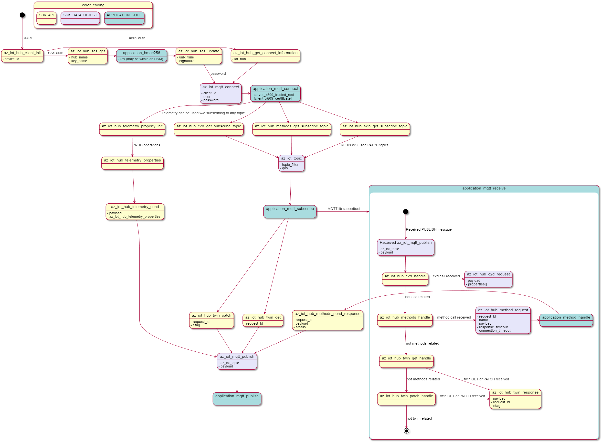

# Azure IoT SDK v2 MQTT State Machine

## High-level architecture

Device Provisioning and IoT Hub service protocols require additional state management on top of the MQTT protocol. The Azure IoT SDK v2 components provide a common programming model for the C SDK.

The following aspects are being handled by the SDK:
1. Generate MQTT CONNECT credentials.
1. Obtain SUBSCRIBE topic filters required by various service features.
1. Output a standardized MQTT PUBLISH object.
1. Parse service errors and output an uniform error object model (i.e. az_result) 
1. Provide the correct sequence of events required to perform an operation. 
1. Provide suggested timing information when retrying operations.

## Components

### IoT Hub


### Device Provisioning Service


### Common Retry Flow


## Design Decisions
Porting requirements:
- The target platform C99 compiler is generating reentrant code. The target platform supports a stack of several kB.
- Our SDK relies on types such as `uint8_t` existing. If a platform doesn't already have them defined, they should be added to the application code using `typedef` statements.

The SDK is provided only for the MQTT protocol. Support for WebSocket/WebProxy tunneling as well as TLS security is not handled by the SDK.

The following API provides a framework and a programming model. Each service feature (telemetry, methods, etc) will have a separate client following the same structure to allow users to only consume and compile Azure IoT features that their devices require.

Assumptions and recommendations for the application:
- Our API does not support unsubscribing from any of the previously subscribed topics. We assume that the device will only set-up topics that must be used.
- It is recommeded that MQTT layer uses the `clean_session == FALSE` during MQTT CONNECT. This allows the application to avoid resubscribing.

## API

### MQTT messages

#### MQTT CONNECT
```C
typedef struct az_iot_mqtt_connect {
    az_span client_id;  // NULL terminated string.
    az_span user;       // NULL terminated string.
    az_span password;   // NULL terminated string (may be an empty string).
} az_iot_mqtt_connect;
```

#### MQTT SUB
```C
typedef struct az_iot_topic {
    az_span name;       // NULL terminated string.
    uint8_t qos;
} az_iot_topic;
```

#### MQTT PUB

`Note:` this applies for the MQTT PUB either sent or received.

```C
typedef struct az_iot_mqtt_pub {
    az_iot_topic topic;
    az_span payload;
} az_iot_mqtt_pub;
```

### Client Initialization
```C
// Provisioning

typedef struct az_provisioning_client {
    struct {
        az_span registration_id;
    } _internal;
} az_provisioning_client;

void az_provisioning_client_init(az_provisioning_client* client, az_span registration_id);

// IoT Hub

typedef struct az_iot_hub_client {
    struct {
        az_span identity;   // deviceId[/moduleId]
    } _internal;
} az_provisioning_client;

void az_iot_hub_client_init(az_iot_hub_client* client, az_span device_id);
void az_iot_hub_client_init(az_iot_hub_client* client, az_span device_id, az_span module_id);
```

### Connect Credentials

Two authentication schemes are currently supported: _X509 Client Certificate Authentication_ and _Shared Access Signature_ authentication. The API must support both cases as well without making assumptions of direct access to secrets (Hardware Security Modules are supported).

```C
// Provisioning
az_result az_provisioning_get_connect_information(az_provisioning_client* client, az_span id_scope, az_iot_mqtt_connect* mqtt_connect);

// IoT Hub
az_result az_iot_get_connect_information(az_iot_hub_client* client, az_span hub_hostname, az_iot_mqtt_connect* mqtt_connect);

// If X509 Client authenticaiton is not used, mqtt_connect.password must contain a valid SAS Token.
// --> TODO SAS token APIs.
```

### Subscribe topic information
Note: All services (Device Provisioning, IoT Hub) require either no subscription (Telemetry) or _a single_ subscription to a topic _filter_.

Each service requiring subscriptions is componentized and must implement a function similar to the following:

```C
// Examples:
az_result az_provisioning_register_get_subscribe_topic(az_provisioning_client* client, az_iot_topic* mqtt_topic_filter);

az_result az_iot_methods_get_subscribe_topic(az_iot_client* client, az_iot_topic* mqtt_topic_filter);
```

### Sending APIs

Each action (e.g. send telemetry, request twin) is represented by a separate public API.
To allow pipelining several operations the state (i.e. `request_id`s) are associated with the request and response objects rather than the client.

_Examples:_

```C
// Telemetry:
typedef struct az_iot_telemetry_property {
    az_span name;
    az_span value;
} az_iot_telemetry_property;

az_result az_iot_sendtelemetry(az_iot_client* client, az_span payload, az_iot_telemetry_property* properties, size_t properties_count, az_iot_mqtt_pub *mqtt_pub); // TODO: telemetry should include an overload with a destination_device_id parameter in order to allow Module 2 Module communication.

// Method response:
typedef struct az_iot_method_response {
    uint8_t status;
    az_span request_id;
    az_span payload;
} az_iot_method_response;

az_result az_iot_methods_send_response(az_iot_client* client, az_iot_method_response* response, az_iot_mqtt_pub *mqtt_pub);
```

### Receiving APIs

Handling incoming MQTT PUB messages is done via a delegating handler architecture to avoid simpler composition as well as allow future modes.

Example MQTT PUB handler implementation:

```C
    az_iot_mqtt_pub pub_received; // Application must fill this structure with the received MQTT PUB data.

    az_result ret;
    az_iot_c2d_request c2d_request;
    az_iot_method_request method_request;
    az_iot_twin_response twin_response;
    
    // TODO: There are 2 failure modes: az_result_iot_not_handled which is expected and other errors.
    // Proposed solutions:
    // 1. use logging from the SDK
    // 2. create an app function az_iot_handled (similar to az_succeded but that prints out errors)
    if (az_succeeded(ret = az_iot_c2d_handle(&iot_client, &pub_received, &c2d_request)))
    {
        // c2d_request contains .payload and .properties / count
    }
    else if (az_succeeded(ret = az_iot_methods_handle(&iot_client, &pub_received, &method_request)))
    {
        // method received: method_request.name
    }
    else if (az_succeeded(ret = az_iot_twin_handle(&iot_client, &pub_received, &twin_response)))
    {
        // process twin update.
    }
```

## Sample Application

### Using ThreadX
[ TODO ]

### Using the Paho synchronous C MQTT library
* [Paho Device Provisioning Sample](dps_paho_sample.c)
* [Paho IoT Hub Sample](iot_paho_sample.c)

## Test plan

Testing the programming model is achieved by using the APIs with multiple MQTT clients to ensure all scenarios can be achieved.
Describing concrete implementations of the APIs is out of scope for this document.

All APIs must be tested for both normal operation as well as error cases. This is achieved in isolation (Unit Testing) by varying inputs and verifying outputs of the above-described APIs. 

E2E Functional testing is required to ensure that the assumptions are correct and that the designed client is compatible with current versions of the Azure IoT services.
